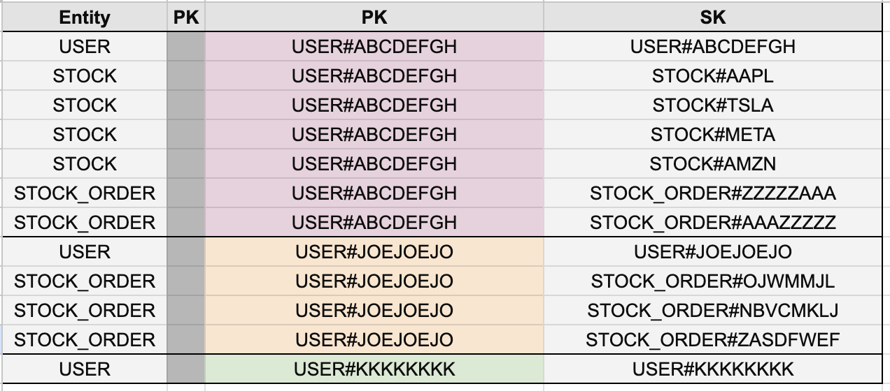

# This is the Flask App used for the Backend

## Functionality
-  Gets stock info from yfinance.
-  Allows users to "buy" and "sell" stock. Keeps track of this internally.

## Endpoints
The flask app acts as a simple REST API with the following endpoints:
```
/home GET # Returns basic User Info and User's Stocks + Orders 
/ticker GET # Returns info about a ticker by calling yfinance API
/order GET # Returns info about an order via user_id + order_id
/order POST # Creates a new order for buying stock
/sell POST # Creates a new order for selling stock
```

## Database
This app uses [DynamoDB Single Table Design](https://www.alexdebrie.com/posts/dynamodb-single-table/).
All schemas can be found in the schemas folder.
Note that that ticker.json is only a draft schema, it's not actually being used.
The table follows the following access patterns:

This allows us to easily retrieve all info for a user or any one individual item with one get / query.
In the future sorting could be implemented to help only query the most recent Orders.

## Background Order Processing
The server accepts user orders immediately as they come in (provided the user has enough balance).
It also accepts a min / max acceptable price for filling the order.
This is typical in stock applications as stock price can fluctuate quickly.
After this, the server proceeds to attempt and fill the order based on the live market price and client provided min / max.
Meanwhile, the client polls the status of the order.

## Improvements
This app is missing unit tests, type hints, and schema validation (when writing to DB).